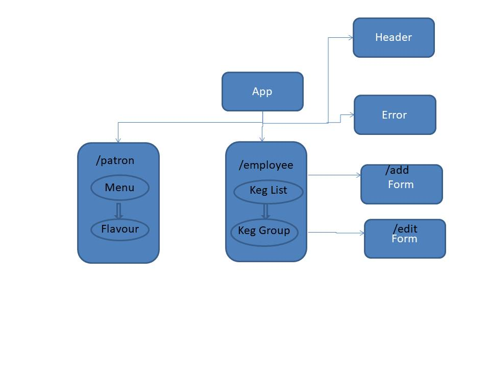

# Kombucha Tap Room

#### _A Web app for tracking kegs at a tap room - September 6, 2019_

#### _By **Saswati Patra**_

## Description
(Work in Progress - UI only)
This Web app will directs the user to either a menu for Patron or an employee site for managing available kegs. 
The menu for oatrons shows available kombuchas on tap, categorized by flavor and their other information example Brand name, price etc.

The employee page shows a list of available kombucha kegs, with additional information about the amount of kombucha left in each keg.  The employer can navigate to a form to submit information about a new keg or to edit an existing keg's details.

## React Component and Route Structure


## Setup/Installation Requirements

1. Clone this repository:
    ```
    $ git clone https://github.com/saswatipatra/TapRoom.git
    ```
2. Install dependencies:
    ```
    $ npm install
    ```
3. Run distribution files:
    ```
    $ npm start
    ```


## Known Bugs
* No known bugs at this time.

## Technologies Used
* JavaScript
* React
* webpack
* npm

## Support and contact details

_Please contact saswati patra with questions and comments._

### License

*GNU GPLv3*

Copyright (c) 2019 **_Saswati Patra_**